# 📋 GENESIS PROTOCOL MVP - Product Requirements Document
## Version 1.0 - September 2025

---

## 1. EXECUTIVE SUMMARY

### 1.1 Product Vision
Genesis Protocol is an autonomous business creation platform that enables anyone to launch AI-operated businesses in under 60 seconds, with instant tokenization and automatic funding at $1,000 MRR.

### 1.2 MVP Objective
Build a functional platform that can create, deploy, and operate 10 autonomous businesses generating real revenue within 30 days, proving the viability of AI-operated businesses with instant liquidity.

### 1.3 Success Metrics
- **10 ABOs** launched and operational
- **$10,000 combined MRR** within 30 days
- **100 active token holders** participating in governance
- **$100,000** in token liquidity
- **Zero human intervention** after initial setup

---

## 2. PROBLEM STATEMENT

### 2.1 Current Market Problems
1. **Startup Barrier**: 99% of people with business ideas never start due to technical, financial, or time constraints
2. **Funding Gap**: Traditional funding takes 3-6 months and requires extensive networking
3. **Execution Complexity**: Running a business requires multiple skills most individuals lack
4. **Liquidity Lock**: Business equity is illiquid until exit (7-10 years)

### 2.2 Why Now (September 2025)
- GPT-5 can write production code with 74.9% accuracy
- Claude Opus 4.1 excels at multi-file refactoring
- Solana achieved 100,000 TPS on mainnet
- $104B flowing into AI startups in H1 2025
- Computer Use APIs enable autonomous operations

---

## 3. SOLUTION OVERVIEW

### 3.1 Core Value Proposition
**"From idea to income in 60 seconds"**

Users input a business idea → AI creates the entire business → Deploys automatically → Generates revenue → Instant token liquidity

### 3.2 Key Innovations
1. **Autonomous Business Organisms (ABOs)**: Self-operating AI entities
2. **Instant Tokenization**: Every business is liquid from day one
3. **Swarm Funding**: Automatic $50k injection at $1k MRR
4. **Zero-Code Creation**: Natural language to running business

---

## 4. MVP SCOPE & FEATURES

### 4.1 In Scope (MVP - 30 Days)

#### Feature 1: Business Template Engine
**Priority**: P0 (Critical)
**Description**: Pre-built, customizable business templates

**Templates**:
1. **AI SaaS Wrapper** (e.g., Resume Builder, Writing Assistant)
2. **Content Generation Service** (e.g., Social Media, Blog Posts)
3. **API Service** (e.g., Data Processing, Image Generation)
4. **Marketplace** (e.g., Prompt Store, AI Model Hub)
5. **Automation Tool** (e.g., Workflow Automation, Data Scraping)

**Technical Requirements**:
- Next.js 14 boilerplate with TypeScript
- Supabase for database and auth
- Stripe integration for payments
- Vercel deployment configuration
- OpenAI/Claude API integration

**Success Criteria**:
- Deploy any template in < 60 seconds
- All templates generate revenue within 24 hours
- 90% deployment success rate

#### Feature 2: AI Business Operator
**Priority**: P0 (Critical)
**Description**: GPT-5 powered autonomous business management

**Capabilities**:
- Customer support (respond to inquiries)
- Content creation (marketing, blogs, social)
- Product iteration (A/B testing, feature updates)
- Financial management (pricing optimization)
- Marketing campaigns (ad creation, targeting)

**Technical Requirements**:
```python
class BusinessOperator:
    capabilities = {
        "autonomous": ["customer_service", "content_creation", "marketing"],
        "human_approval": ["pricing_changes", "major_pivots", "large_expenses"],
        "scheduled": ["daily_reports", "weekly_optimization", "monthly_review"]
    }
```

**Success Criteria**:
- 95% customer inquiry response rate
- 80% customer satisfaction score
- 10% month-over-month growth without human intervention

#### Feature 3: Instant Token Generation
**Priority**: P0 (Critical)
**Description**: Automatic ERC-20 token creation for each business

**Token Mechanics**:
```solidity
contract BusinessToken {
    string public name;          // "BusinessName Token"
    string public symbol;        // "BIZ"
    uint256 totalSupply = 1_000_000;
    
    Distribution:
    - 30% to founder
    - 20% to liquidity pool
    - 20% to Genesis treasury
    - 20% to operations wallet
    - 10% to early supporters
    
    Revenue Share:
    - 40% buyback and burn
    - 30% operations
    - 20% Genesis protocol
    - 10% insurance fund
}
```

**Success Criteria**:
- Token deployed within 10 seconds of business creation
- Automatic Uniswap V3 pool creation
- Minimum $1,000 initial liquidity

#### Feature 4: Revenue Tracking Dashboard
**Priority**: P0 (Critical)
**Description**: Real-time business metrics and control panel

**Dashboard Components**:
- Revenue metrics (MRR, growth, churn)
- Customer analytics (acquisition, LTV, CAC)
- AI operator logs (decisions, actions, results)
- Token metrics (price, liquidity, holders)
- Control panel (pause, override, settings)

**Technical Requirements**:
- Real-time WebSocket updates
- Recharts for data visualization
- PostgreSQL for data storage
- Redis for caching

**Success Criteria**:
- < 1 second data latency
- Mobile responsive design
- Export functionality for all data

#### Feature 5: Swarm Funding Mechanism
**Priority**: P1 (Important)
**Description**: Automatic funding at revenue milestones

**Funding Triggers**:
```javascript
const fundingMilestones = {
    $1000_MRR: {
        amount: $50_000,
        source: "Genesis Treasury",
        automatic: true
    },
    $10_000_MRR: {
        amount: $500_000,
        source: "Swarm Vote",
        automatic: false
    }
}
```

**Success Criteria**:
- Funding deployed within 1 hour of trigger
- 100% accuracy in MRR verification
- Smart contract security audit passed

### 4.2 Out of Scope (Post-MVP)
- Business DNA evolution system
- Cross-business breeding/merging
- Neural interface integration
- Quantum optimization
- Multi-chain deployment
- Fiat payment processing
- Legal entity automation
- Complex AI reasoning chains

---

## 5. USER JOURNEY

### 5.1 Target Users

#### Primary: Aspiring Entrepreneurs
- Age: 18-35
- Tech-savvy but not developers
- Have ideas but lack execution ability
- Want passive income streams
- Active in crypto/AI communities

#### Secondary: Existing Business Owners
- Want to automate operations
- Looking for additional revenue streams
- Interested in tokenization
- Need AI integration

### 5.2 User Flow

```mermaid
graph LR
    A[Land on Homepage] --> B[Connect Wallet]
    B --> C[Input Business Idea]
    C --> D[Select Template]
    D --> E[AI Customizes Business]
    E --> F[Review & Launch]
    F --> G[Business Deployed]
    G --> H[Token Created]
    H --> I[Revenue Starts]
    I --> J[Monitor Dashboard]
    J --> K[Receive Profits]
```



### 5.3 Example User Story

**Sarah, 26, Marketing Manager**
1. Discovers Genesis through Twitter
2. Connects MetaMask wallet
3. Inputs idea: "AI Instagram Caption Generator"
4. Selects "AI SaaS Wrapper" template
5. Reviews AI-generated business plan
6. Clicks "Launch for $99"
7. Business deploys in 45 seconds
8. Receives 300,000 IGCAP tokens
9. First customer signs up in 2 hours
10. Reaches $1,000 MRR in 2 weeks
11. Receives $50,000 automatic funding
12. Sells 10% of tokens for $15,000
13. Business runs autonomously while she works day job

---

## 6. TECHNICAL ARCHITECTURE

### 6.1 System Architecture

```yaml
Frontend:
  Framework: Next.js 14 with TypeScript
  Styling: Tailwind CSS
  Web3: Wagmi v2, Viem
  State: Zustand
  API: tRPC

Backend:
  Runtime: Node.js 20
  Framework: Express + tRPC
  Database: PostgreSQL (Supabase)
  Cache: Redis
  Queue: BullMQ
  
AI Layer:
  Primary: GPT-5 API
  Secondary: Claude Opus 4.1
  Fallback: GPT-4o
  Local: Llama 3.1 405B
  
Blockchain:
  Primary: Solana (100k TPS)
  Secondary: Base L2 (Ethereum)
  Contracts: Anchor (Solana), Solidity (Base)
  Indexer: Helius (Solana), The Graph (Base)
  
Infrastructure:
  Hosting: Vercel (Frontend)
  API: Railway (Backend)
  Database: Supabase
  Storage: AWS S3
  CDN: Cloudflare
  Monitoring: Datadog
```

### 6.2 Smart Contract Architecture

```solidity
// Core Contracts (Solana - Anchor Framework)
GenesisFactory.sol       // Creates new ABOs
BusinessToken.sol        // ERC-20 token template
RevenueShare.sol        // Handles revenue distribution
SwarmTreasury.sol       // Manages funding pools
GovernanceModule.sol    // Token-based voting

// Key Functions
createBusiness()        // Deploys new ABO
mintTokens()           // Creates business tokens
distributeFunding()    // Triggers at MRR milestones
shareRevenue()         // Distributes profits
executeSwarmVote()     // Processes governance decisions
```

### 6.3 API Architecture

```typescript
// API Endpoints
POST   /api/business/create
GET    /api/business/:id
POST   /api/business/:id/operate
GET    /api/business/:id/metrics
POST   /api/token/mint
GET    /api/token/:address
POST   /api/funding/trigger
GET    /api/swarm/votes
POST   /api/ai/generate
POST   /api/ai/operate
```

---

## 7. MONETIZATION MODEL

### 7.1 Revenue Streams

#### Platform Fees
- **Creation Fee**: $99 one-time per ABO
- **Operation Fee**: 10% of ABO revenue
- **Token Transaction Fee**: 0.5% on trades
- **Premium Features**: $299/month for advanced tools

#### Token Economics ($GENESIS)
- **Total Supply**: 1,000,000,000
- **Initial Price**: $0.01
- **Target Market Cap**: $100M (Month 6)

### 7.2 Financial Projections (30 Days)

```yaml
Revenue:
  Creation Fees: 100 ABOs × $99 = $9,900
  Operation Fees: $10,000 MRR × 10% = $1,000
  Token Sales: $100,000 (initial liquidity)
  Total Month 1: $110,900

Costs:
  AI APIs: $2,000
  Infrastructure: $1,000
  Smart Contract Audits: $10,000
  Marketing: $5,000
  Team (2 people): $20,000
  Total Month 1: $38,000

Net Profit Month 1: $72,900
```

---

## 8. DEVELOPMENT ROADMAP

### 8.1 Sprint 1 (Days 1-7): Foundation
- [ ] Smart contract development
- [ ] Basic frontend UI
- [ ] GPT-5 integration
- [ ] First template creation
- [ ] Deployment pipeline

### 8.2 Sprint 2 (Days 8-14): Core Features  
- [ ] 5 business templates
- [ ] Token generation system
- [ ] Revenue tracking
- [ ] AI operator basic mode
- [ ] Dashboard v1

### 8.3 Sprint 3 (Days 15-21): Testing
- [ ] Launch 10 test ABOs
- [ ] Security audit
- [ ] Performance optimization
- [ ] Bug fixes
- [ ] Documentation

### 8.4 Sprint 4 (Days 22-30): Launch
- [ ] Public launch
- [ ] Marketing campaign
- [ ] First 100 users
- [ ] Token liquidity
- [ ] Community building

---

## 9. RISKS & MITIGATION

### 9.1 Technical Risks

| Risk | Probability | Impact | Mitigation |
|------|------------|--------|------------|
| AI hallucinations | Medium | High | Multiple AI models, human oversight for critical decisions |
| Smart contract bugs | Low | Critical | Professional audit, bug bounty program |
| Scalability issues | Medium | Medium | Start with 100 ABO limit, progressive scaling |
| API rate limits | High | Medium | Multiple API keys, local model fallback |

### 9.2 Business Risks

| Risk | Probability | Impact | Mitigation |
|------|------------|--------|------------|
| Regulatory action | Medium | High | DAO structure, legal counsel, compliance framework |
| Competition | High | Medium | First-mover advantage, network effects, token incentives |
| User adoption | Medium | High | Influencer partnerships, success stories, low barrier ($99) |
| Token volatility | High | Medium | Liquidity locks, vesting schedules, utility focus |

### 9.3 Operational Risks

| Risk | Probability | Impact | Mitigation |
|------|------------|--------|------------|
| Team burnout | Medium | High | Realistic timeline, automation, hire early |
| Funding shortage | Low | Medium | Token sales, revenue from day 1, VC backup plan |
| Technical debt | High | Low | Clean code, documentation, refactor sprints |

---

## 10. SUCCESS CRITERIA

### 10.1 MVP Success Metrics (30 Days)

#### Quantitative
- ✅ 10 operational ABOs
- ✅ $10,000 combined MRR
- ✅ 100 active users
- ✅ $100,000 token liquidity
- ✅ 90% uptime
- ✅ < 60 second deployment time

#### Qualitative
- ✅ Positive user feedback (NPS > 50)
- ✅ Media coverage (3+ articles)
- ✅ Community engagement (1000+ Discord members)
- ✅ Strategic partnerships (2+ integrations)

### 10.2 Long-term Vision Validation
- Prove AI can operate businesses autonomously
- Demonstrate instant liquidity model works
- Validate swarm funding mechanism
- Build foundation for 1M ABOs

---

## 11. TEAM & RESOURCES

### 11.1 Core Team (MVP)
- **Founder/CEO**: Product vision, partnerships, fundraising
- **Senior Developer**: Smart contracts, backend, infrastructure
- **Claude Code**: Frontend, AI integration, automation

### 11.2 Advisors Needed
- Crypto/DeFi expert
- AI/ML researcher  
- Legal/compliance specialist
- Growth marketer

### 11.3 Budget Requirements
- **Development**: $50,000
- **Infrastructure**: $5,000
- **Audits**: $15,000
- **Marketing**: $10,000
- **Legal**: $10,000
- **Buffer**: $10,000
- **Total**: $100,000

---

## 12. COMPETITIVE ANALYSIS

### 12.1 Direct Competitors
None exist yet combining:
- AI business operation
- Instant tokenization
- Autonomous revenue generation
- Swarm funding

### 12.2 Indirect Competitors

| Competitor | Strength | Weakness | Our Advantage |
|------------|----------|----------|---------------|
| Bubble.io | No-code platform | Not AI-operated | Full autonomy |
| Replit | AI coding | No business focus | Revenue generation |
| Coinbase Ventures | Funding | Traditional process | Instant liquidity |
| GPT Store | AI apps | No tokenization | Ownership economy |

### 12.3 Competitive Moat
1. **Network Effects**: More ABOs = more data = better AI
2. **Token Ecosystem**: Aligned incentives for all participants
3. **First Mover**: 6-12 month head start
4. **Technical Barrier**: Complex orchestration hard to replicate

---

## 13. GO-TO-MARKET STRATEGY

### 13.1 Launch Strategy (Week 1)
1. **Soft Launch**: 10 beta users from network
2. **Success Story**: Document first $10k MRR ABO
3. **Press Release**: "First AI-Run Business Hits $10k MRR"
4. **Influencer Outreach**: Crypto + AI thought leaders
5. **Token Airdrop**: Early supporters and beta testers

### 13.2 Growth Channels
- **Organic**: SEO, content marketing, success stories
- **Paid**: Google Ads, Twitter Ads, YouTube sponsorships  
- **Community**: Discord, Twitter Spaces, AMAs
- **Partnerships**: AI tools, crypto platforms, accelerators
- **Viral**: "$0 to $10k MRR in 30 days" challenges

### 13.3 Positioning
**"The platform where AI builds your business while you sleep"**

Key Messages:
- No code required
- Instant liquidity
- Passive income
- Future of work
- Democratized entrepreneurship

---

## 14. APPENDICES

### 14.1 Technical Specifications
[Link to detailed technical docs]

### 14.2 Smart Contract Audit
[Link to audit report - pending]

### 14.3 Legal Opinion
[Link to legal framework - pending]

### 14.4 Financial Model
[Link to detailed projections]

### 14.5 User Research
[Link to user interviews and surveys]

---

## 15. APPROVAL & SIGN-OFF

| Role | Name | Signature | Date |
|------|------|-----------|------|
| Founder/CEO | [Name] | _______ | _____ |
| Lead Developer | [Name] | _______ | _____ |
| Legal Advisor | [Name] | _______ | _____ |
| Technical Advisor | [Name] | _______ | _____ |

---

**Document Status**: DRAFT  
**Version**: 1.0  
**Last Updated**: September 2025  
**Next Review**: October 2025

---

*"The best time to plant a tree was 20 years ago. The second best time is now."*

*"The best time to launch an ABO was yesterday. The second best time is in the next 60 seconds."*

**LET'S BUILD THE FUTURE. TODAY.** 🚀